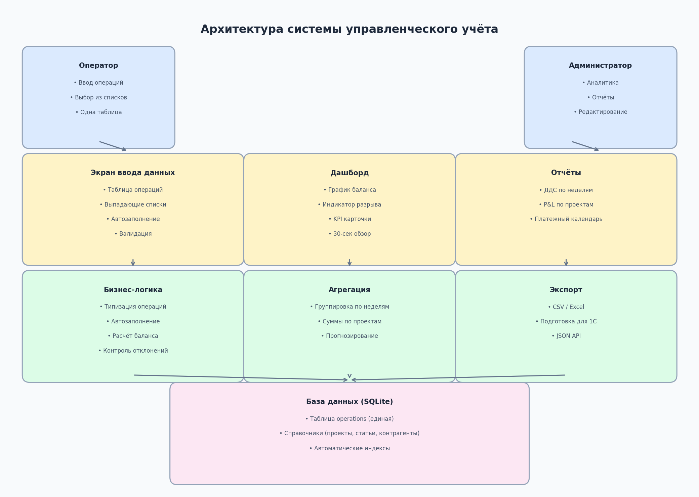
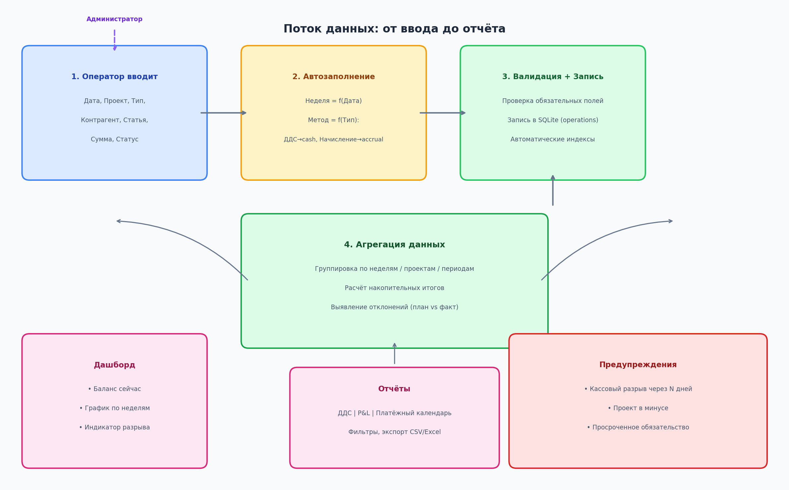
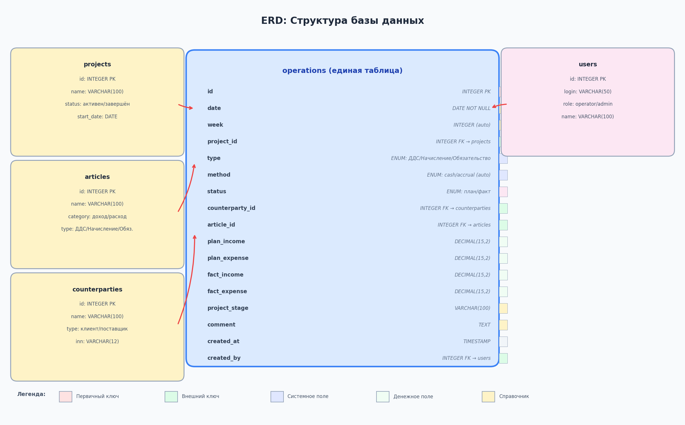
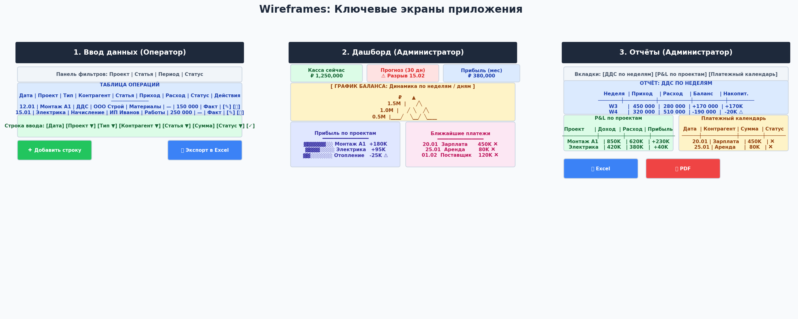

# План реализации: Система управленческого учёта

## TL;DR

ТЗ на систему управленческого учёта для строительной компании **полностью реализуемо** в виде лёгкого web-приложения. Концепция «одна таблица — три типа операций» (ДДС / Начисление / Обязательство) позволяет уместить всю логику в минимальном коде без ERP-сложности. Рекомендуемый стек: **React + Vite + TypeScript + Tailwind CSS + shadcn/ui** на фронтенде, **SQLite** через **Drizzle ORM** на бэкенде. Запуск локально через **Tauri** (desktop) или **Node.js + Express**. MVP возможен за **2–3 недели** при последовательной реализации четырёх этапов: ввод данных → отчёты → дашборд → экспорт и предупреждения.

---

## 1. Анализ технического задания

### 1.1 Бизнес-контекст и проблематика

Компания работает в сфере строительных проектов (монтаж, объекты). Ключевая проблема — отсутствие прозрачного управленческого учёта. Сегодня денежные потоки, подписанные акты и обязательства существуют в разрозненных источниках: Excel-таблицы, банковские выписки, устные договорённости. Это приводит к тому, что собственник принимает решения «вслепую» — не видит реальной прибыльности проектов, не может спрогнозировать кассовый разрыв, не понимает, какие обязательства накоплены. ТЗ предлагает закрыть эти пробелы через единую систему, которая связывает все три типа событий в одном массиве данных.

### 1.2 Ключевые требования: разбор по пунктам

| № | Требование ТЗ | Сложность реализации | Критичность | Примечание |
|---|---|---|---|---|
| 1 | Единая таблица operations | Низкая | Критично | Сердце системы — одна таблица вместо ERP-модуля |
| 2 | Три типа операций (ДДС / Начисление / Обязательство) | Низкая | Критично | Разделение через поле `type`, не через таблицы |
| 3 | Автозаполнение (неделя, метод) | Низкая | Высокая | Чисто клиентская логика |
| 4 | Две роли (Оператор / Администратор) | Низкая | Критично | Простая проверка `role` при входе |
| 5 | Отчёт ДДС по неделям | Средняя | Критично | Группировка + накопительный итог |
| 6 | Отчёт P&L по проектам | Средняя | Критично | Агрегация доходов и расходов |
| 7 | Платёжный календарь | Низкая | Критично | Фильтр по типу + сортировка по дате |
| 8 | График баланса | Средняя | Высокая | Визуализация через Recharts |
| 9 | Индикатор кассового разрыва | Средняя | Критично | Расчёт прогноза + цветовая сигнализация |
| 10 | Экспорт CSV/Excel | Низкая | Средняя | Библиотека `xlsx` |
| 11 | Подготовка для миграции в 1С | Низкая | Средняя | Структурированный экспорт |
| 12 | 30-секундный обзор для собственника | Средняя | Критично | Дашборд с 4 KPI-карточками |

**Вывод по анализу:** Ни одно из требований не выходит за рамки стандартных возможностей современного web-стека. Сложность системы — «лёгкая», характерная для внутренних инструментов управления. Никакой ERP-логики (проводки, двойная запись, бухгалтерские счета) не требуется, что существенно снижает порог реализации.

---

## 2. Рекомендуемый стек технологий

### 2.1 Обоснование выбора

При выборе стека я исходил из трёх критериев ТЗ: **лёгкость** (быстрая разработка, минимум конфигурации), **универсальность** (можно запустить на Windows/Mac/Linux без танцев с докером), и **простота интерфейса** (готовые компоненты, минимум кастомной вёрстки). На рынке существует множество комбинаций, но не все подходят под задачу локального запуска без инфраструктуры.

| Компонент | Выбор | Альтернативы | Почему именно это |
|---|---|---|---|
| **Фреймворк UI** | React + Vite | Vue, Svelte, Angular | Vite — мгновенный HMR, React — экосистема компонентов |
| **Стилизация** | Tailwind CSS | Bootstrap, MUI, CSS-modules | Утилитарные классы = быстрая вёрстка, минимум кастомного CSS |
| **UI-компоненты** | shadcn/ui | Ant Design, Material UI | Копируемые компоненты, полный контроль, лёгкая кастомизация |
| **Язык** | TypeScript | JavaScript | Типобезопасность для финансовых данных — must have |
| **Графики** | Recharts | Chart.js, D3 | Declarative API, нативная интеграция с React |
| **База данных** | SQLite | PostgreSQL, MySQL | Zero-config файл БД, идеально для локального запуска |
| **ORM** | Drizzle ORM | Prisma, TypeORM | Лёгкий, SQL-like синтаксис, отличная работа с SQLite |
| **Рантайм** | Tauri | Electron, Node.js | Rust-based, вес ~3MB, без Chromium внутри, нативная SQLite |
| **Экспорт** | SheetJS (`xlsx`) | PapaParse | Прямая запись .xlsx без сервера |

### 2.2 Почему Tauri вместо Electron или чистого Node.js

Tauri выбран как оптимальный вариант для локального запуска по нескольким причинам. Во-первых, размер приложения: Tauri-приложение весит около **3–5 МБ**, тогда как Electron — **150+ МБ** из-за встроенного Chromium. Во-вторых, Tauri использует нативный webview ОС (WebKit на macOS, WebView2 на Windows, WebKitGTK на Linux), что означает современный движок рендеринга без лишних зависимостей. В-третьих, Rust-бэкенд Tauri позволяет напрямую работать с SQLite через `rusqlite` или `sqlx` — без необходимости поднимать отдельный Node.js-сервер. Для сравнения: Electron требует либо встроенного Node.js-процесса, либо отдельного бэкенда, что усложняет архитектуру. Чистый Node.js + Express требует запуска сервера перед открытием приложения, что неудобно для нетехнического пользователя. Tauri упаковывает всё в один `.exe` (или `.app`/`.deb`), который запускается двойным кликом.

---

## 3. Архитектура приложения

### 3.1 Многоуровневая структура

Архитектура построена по классической схеме «презентация → логика → данные» с чётким разделением ответственности. Всё приложение размещается локально: фронтенд (React) работает внутри Tauri-окна, бэкенд (Rust) обеспечивает доступ к SQLite, база данных хранится в файле рядом с приложением.

**Уровень пользователей.** Две роли с чётко разделёнными полномочиями. Оператор видит только экран ввода данных и не имеет доступа к аналитике. Администратор видит весь функционал: ввод, дашборд, отчёты, управление справочниками. Разграничение реализуется на уровне маршрутизации React Router: при попытке оператора открыть `/dashboard` или `/reports` происходит редирект на `/input`.

**Уровень презентации (UI).** Три ключевых экрана: ввод данных, дашборд, отчёты. Все экраны используют единую систему дизайна на базе Tailwind + shadcn/ui. Навигация — боковое меню (для администратора) или фиксированный заголовок с табами.

**Уровень бизнес-логики.** Здесь происходит типизация операций, автозаполнение производных полей, валидация вводимых данных, расчёт агрегатов. Вся логика написана на TypeScript, что обеспечивает типобезопасность при работе с финансовыми суммами.

**Уровень данных.** SQLite-файл с пятью таблицами: `operations` (единая), `projects`, `articles`, `counterparties`, `users`. Drizzle ORM обеспечивает типизированный доступ к данным и миграции схемы.

### 3.2 Поток данных: от ввода до отчёта

Любая операция проходит через четыре стадии: ввод → автозаполнение → валидация и запись → агрегация → отображение. Этот pipeline гарантирует, что данные всегда консистентны, а пользователь видит результат своих действий мгновенно.

На стадии **ввода** оператор заполняет только обязательные поля: дату, проект, тип операции, контрагента, статью, сумму и статус. Система не требует от него понимания разницы между cash и accrual — это автоматически определяется по типу. На стадии **автозаполнения** вычисляются неделя (номер недели года из даты) и метод учёта (cash для ДДС, accrual для Начисления). На стадии **валидации** проверяется, что заполнены все обязательные поля, сумма положительна, дата не из будущего (для статуса «факт»). После успешной валидации запись сохраняется в SQLite. На стадии **агрегации** система пересчитывает все отчётные показатели: дашборд обновляется, отчёты перестраиваются, предупреждения переоцениваются. Благодаря небольшому объёму данных (сотни записей в месяц), полный пересчёт занимает доли секунды.

---

## 4. Проектирование базы данных

### 4.1 Единая таблица operations

Концепция «одна таблица» — ключевое архитектурное решение ТЗ. Вместо разделения на отдельные таблицы для платежей, актов и обязательств, все события хранятся в одной таблице `operations`. Различие достигается через поле `type`, которое определяет семантику записи. Такой подход даёт три преимущества: простота запросов (не нужны JOIN'ы между таблицами разных типов), единый интерфейс ввода (оператор всегда работает с одной формой), лёгкость агрегации (любой отчёт строится фильтрацией по `type`).

### 4.2 Структура таблицы operations

| Поле | Тип | Обязательное | Авто-заполнение | Описание |
|---|---|---|---|---|
| `id` | INTEGER PK | Да | Нет | Автоинкрементный первичный ключ |
| `date` | DATE | Да | Нет | Дата события (платежа, акта, обязательства) |
| `week` | INTEGER | Да | **Да** | Номер недели года, вычисляется из `date` |
| `project_id` | INTEGER FK | Да | Нет | Ссылка на справочник проектов |
| `type` | VARCHAR(20) | Да | Нет | ДДС / Начисление / Обязательство |
| `method` | VARCHAR(10) | Да | **Да** | cash (ДДС) / accrual (Начисление) |
| `status` | VARCHAR(10) | Да | Нет | план / факт |
| `counterparty_id` | INTEGER FK | Нет | Нет | Ссылка на контрагента |
| `article_id` | INTEGER FK | Да | Нет | Ссылка на статью дохода/расхода |
| `plan_income` | DECIMAL(15,2) | Нет | Нет | Плановый приход (для обязательств) |
| `plan_expense` | DECIMAL(15,2) | Нет | Нет | Плановый расход (для обязательств) |
| `fact_income` | DECIMAL(15,2) | Нет | Нет | Фактический приход (ДДС) |
| `fact_expense` | DECIMAL(15,2) | Нет | Нет | Фактический расход (ДДС) |
| `project_stage` | VARCHAR(100) | Нет | Нет | Этап проекта (опционально) |
| `comment` | TEXT | Нет | Нет | Произвольный комментарий |
| `created_at` | TIMESTAMP | Да | **Да** | Дата создания записи |
| `created_by` | INTEGER FK | Да | **Да** | Ссылка на пользователя, создавшего запись |

### 4.3 Справочники

**Таблица `projects`** хранит перечень строительных объектов. Поля: `id`, `name` (название, например «Монтаж А1»), `status` (активен / завершён / приостановлен), `start_date`, `end_date` (плановая дата завершения), `budget` (плановый бюджет, опционально). Статус «завершён» исключает проект из активных фильтров, но сохраняет историю.

**Таблица `articles`** содержит статьи доходов и расходов, привязанные к типу операции. Поля: `id`, `name` (например «Материалы», «Работы подрядчика», «Аренда оборудования»), `category` (доход / расход), `type` (ДДС / Начисление / Обязательство). Связь с типом операции позволяет фильтровать статьи в выпадающем списке: при выборе «ДДС» показываются только статьи с `type = 'ДДС'` или `type = 'Обязательство'`.

**Таблица `counterparties`** — контрагенты. Поля: `id`, `name` (название организации или ФИО ИП), `type` (клиент / поставщик / подрядчик / сотрудник), `inn` (ИНН, опционально), `contact` (контактные данные, опционально).

**Таблица `users`** — пользователи системы. Поля: `id`, `login`, `password_hash` (bcrypt), `role` (operator / admin), `name` (отображаемое имя), `is_active`. Аутентификация локальная, без внешних сервисов.

### 4.4 Индексы для производительности

Несмотря на небольшой объём данных (тысячи, не миллионы записей), правильные индексы ускоряют построение отчётов. Рекомендуемые индексы: `idx_operations_date` (по полю `date` — для временных фильтров), `idx_operations_project` (по `project_id` — для P&L по проектам), `idx_operations_type` (по `type` — для всех отчётов), `idx_operations_week` (по `week` — для ДДС по неделям), `idx_operations_status` (по `status` — для отделения плана от факта).

---

## 5. Проектирование интерфейса

### 5.1 Принципы UX: минимализм и защита от ошибок

Интерфейс спроектирован вокруг тезиса ТЗ: «оператор не должен думать, куда писать». Это означает три принципа: **одна точка входа** (все данные вводятся в одну таблицу, независимо от типа операции), **выпадающие списки везде где возможно** (исключают опечатки и несогласованность), **автозаполнение всего, что можно вычислить** (неделя из даты, метод из типа). Каждый экран проходит проверку на «30-секундный тест»: может ли собственник, открыв его впервые, понять, что происходит, за полминуты.

### 5.2 Wireframes экранов

**Экран 1: Ввод данных (Оператор).** Главный и единственный экран для оператора. Состоит из панели фильтров (позволяет быстро найти существующие записи), таблицы операций с сортировкой и пагинацией, строки быстрого ввода (инлайн-форма для добавления новой записи без перехода на другую страницу), и кнопок массовых действий. Таблица отображает все поля operations в компактном виде. Действия в каждой строке: редактировать, удалить (с подтверждением). Добавление новой операции — через инлайн-форму внизу таблицы: оператор выбирает проект из выпадающего списка, тип из списка, контрагента, статью, вводит сумму, выбирает статус. Поля «Неделя» и «Метод» заполняются автоматически и показываются серым цветом (не редактируются вручную).

**Экран 2: Дашборд (Администратор).** Стартовый экран после входа администратора. Три KPI-карточки в верхнем ряду: касса сейчас (сумма всех фактических приходов минус расходы), прогноз кассы на 30 дней вперёд (с учётом обязательств), прибыль текущего месяца (по начислениям). Центральная зона — линейный график баланса по неделям или дням (переключатель). Нижний ряд: мини-отчёт «Прибыль по проектам» (горизонтальные bar-чарты) и «Ближайшие платежи» (список обязательств со статусом выполнения). Индикатор кассового разрыва — карточка в правом верхнем углу, которая загорается красным, если прогноз показывает отрицательный баланс в любой из ближайших 4 недель.

**Экран 3: Отчёты (Администратор).** Три вкладки, соответствующие трём типам отчётов из ТЗ. Каждая вкладка содержит таблицу-отчёт с фильтрами (период, проект, контрагент) и кнопками экспорта в Excel и PDF. Вкладка «ДДС по неделям» показывает неделю, сумму приходов, сумму расходов, недельный баланс и накопительный баланс. Вкладка «P&L по проектам» — проект, доход (начисленные приходы), расход (начисленные расходы), прибыль, маржа в процентах. Вкладка «Платёжный календарь» — дата, контрагент, сумма, статус (выполнено / не выполнено), оставшиеся дни.

### 5.3 Навигация и доступ по ролям

| Роль | Экраны | Действия | Ограничения |
|---|---|---|---|
| **Оператор** | Ввод данных | Создание, редактирование, удаление операций | Нет доступа к дашборду и отчётам |
| **Администратор** | Ввод данных, Дашборд, Отчёты, Справочники | Полный CRUD операций, просмотр аналитики, экспорт, управление справочниками, добавление пользователей | Полный доступ |

Навигация реализована через боковое меню (sidebar) для администратора и минимальный заголовок для оператора. При входе в систему определяется роль пользователя, и интерфейс адаптируется соответственно.

---

## 6. Логика отчётов

### 6.1 Отчёт ДДС по неделям

Этот отчёт отвечает на главный вопрос кассира: «Когда у нас закончатся деньги?». Логика построения: из таблицы `operations` отбираются записи с `type = 'ДДС'`, группируются по полю `week`, для каждой недели суммируются `fact_income` и `fact_expense`. Накопительный баланс вычисляется как бегущая сумма: `balance_cumulative[i] = balance_cumulative[i-1] + (income[i] - expense[i])`. Если накопительный баланс становится отрицательным — это кассовый разрыв, строка подсвечивается красным.

| Неделя | Приход (₽) | Расход (₽) | Баланс (₽) | Накопительный (₽) | Статус |
|---|---|---|---|---|---|
| W1 | 500 000 | 200 000 | +300 000 | +300 000 | 🟢 |
| W2 | 350 000 | 280 000 | +70 000 | +370 000 | 🟢 |
| W3 | 200 000 | 450 000 | −250 000 | +120 000 | 🟡 |
| W4 | 150 000 | 380 000 | −230 000 | **−110 000** | 🔴 Разрыв |

### 6.2 Отчёт P&L по проектам

Отчёт прибыльности отвечает на вопрос: «Какие проекты зарабатывают, а какие нет?». Логика: из `operations` отбираются записи с `type = 'Начисление'`, группируются по `project_id`. Для каждого проекта суммируются начисленные доходы (статьи категории «доход») и начисленные расходы (статьи категории «расход»). Прибыль = доход − расход. Маржа = прибыль / доход × 100%. Отрицательная прибыль подсвечивается красным, маржа ниже целевой (например, 15%) — жёлтым.

| Проект | Доход (₽) | Расход (₽) | Прибыль (₽) | Маржа | Статус |
|---|---|---|---|---|---|
| Монтаж А1 | 1 200 000 | 850 000 | +350 000 | 29.2% | 🟢 |
| Электрика Б2 | 680 000 | 620 000 | +60 000 | 8.8% | 🟡 Низкая маржа |
| Отопление В3 | 450 000 | 520 000 | **−70 000** | −15.6% | 🔴 Убыток |

### 6.3 Платёжный календарь

Платёжный календарь — это проекция будущих денежных потоков. Логика: из `operations` отбираются записи с `type = 'Обязательство'` и `status = 'план'`, сортируются по `date` по возрастанию. Для каждой записи вычисляется количество дней до платежа. Обязательства с просроченной датой (меньше текущей) подсвечиваются красным. Обязательства, наступающие в ближайшие 7 дней — жёлтым. Собственник видит «горизонт» платежей и может планировать поступления.

| Дата | Контрагент | Статья | Сумма (₽) | До платежа | Статус |
|---|---|---|---|---|---|
| 20.01 | ООО Строймат | Материалы | 120 000 | 3 дня | 🟡 Срочно |
| 25.01 | ИП Иванов | Зарплата | 450 000 | 8 дней | ⚪ Запланировано |
| 01.02 | ООО Рентал | Аренда | 80 000 | 15 дней | ⚪ Запланировано |

---

## 7. Этапы реализации

### 7.1 Фаза 1: MVP — Ввод данных (неделя 1)

Цель: оператор может вносить данные, администратор может их видеть. На этом этапе создаётся каркас приложения, база данных, экран ввода с таблицей операций и базовая аутентификация. Результат — работающая форма ввода с сохранением в SQLite.

### 7.2 Фаза 2: Отчёты (неделя 1–2)

Цель: администратор может строить три ключевых отчёта. Реализуются вкладки ДДС, P&L и платёжного календаря с фильтрами. Добавляется экспорт в CSV/Excel. Результат — полноценная аналитика по историческим данным.

### 7.3 Фаза 3: Дашборд и визуализация (неделя 2)

Цель: собственник за 30 секунд понимает состояние дел. Реализуется экран дашборда с KPI-карточками, графиком баланса, индикатором кассового разрыва. Результат — визуальный «командный центр».

### 7.4 Фаза 4: Предупреждения и полировка (неделя 2–3)

Цель: система сама предупреждает о проблемах. Реализуются автоматические алерты (кассовый разрыв, убыточный проект, просроченное обязательство), управление справочниками (CRUD проектов, статей, контрагентов), добавление пользователей. Результат — production-ready приложение.

| Этап | Срок | Что внутри | Чек-поинт |
|---|---|---|---|
| **Фаза 1: Ввод данных** | Неделя 1 | Tauri + React каркас, SQLite схема, Drizzle ORM, таблица operations, инлайн-форма ввода, аутентификация (2 роли) | Оператор вносит 10 тестовых записей |
| **Фаза 2: Отчёты** | Неделя 1–2 | 3 вкладки отчётов, фильтры, группировка, агрегация, экспорт CSV/Excel | Администратор строит все 3 отчёта |
| **Фаза 3: Дашборд** | Неделя 2 | KPI-карточки, график баланса (Recharts), индикатор разрыва | Собственник видит состояние за 30 секунд |
| **Фаза 4: Алерты + полировка** | Неделя 2–3 | Предупреждения, CRUD справочников, управление пользователями, тестирование | Система готова к ежедневной эксплуатации |

---

## 8. Оценка рисков и пути их снижения

| Риск | Вероятность | Влияние | Митигация |
|---|---|---|---|
| **Оператор путает типы операций** | Высокая | Высокое | Цветовая кодировка типов (ДДС — синий, Начисление — зелёный, Обязательство — оранжевый) + подсказки в интерфейсе |
| **Дублирование записей** | Средняя | Среднее | Уникальный индекс по комбинации (date, project_id, counterparty_id, amount) + визуальное предупреждение |
| **База данных повреждается** | Низкая | Критичное | Автоматические бэкапы SQLite при каждом запуске, хранение копий |
| **Производительность при росте данных** | Низкая | Среднее | Индексы по ключевым полям, SQLite без проблем держит 100K+ записей |
| **Пользователь забывает пароль** | Высокая | Низкое | Хранение хэшей, сброс через администратора (нет email-сервера) |
| **Нужна интеграция с 1С** | Средняя | Среднее | Структурированный CSV-экспорт сопоставим с форматом загрузки 1С |

---

## 9. Критерий готовности: проверка на «30 секунд»

Главный критерий успеха из ТЗ: собственник за 30 секунд должен понимать четыре вещи. Проверим, как план реализации это обеспечивает:

1. **Сколько денег сейчас** — KPI-карточка «Касса сейчас» на дашборде, видна сразу при входе.
2. **Когда будет кассовый разрыв** — карточка «Прогноз (30 дн)» с цветовой индикацией + красная подсветка на графике.
3. **Какие проекты прибыльные** — мини-отчёт «Прибыль по проектам» на дашборде, зелёные/красные bar-чарты.
4. **Где отклонения** — алерты в правом верхнем углу + таблица отклонений план/факт.

Если все четыре элемента видны на одном экране без прокрутки — критерий выполнен.

---

## 10. Вывод: реализуемость и следующие шаги

Техническое задание описывает **вполне реализуемую** систему управленческого учёта уровня сложности «внутренний инструмент среднего веса». Ключевые архитектурные решения (единая таблица, три типа операций, автозаполнение) ложатся на современный web-стек естественным образом. Ни одно из требований не требует изобретения велосипеда или интеграции с внешними сервисами. **Оценка трудоёмкости: 2–3 недели одного разработчика** на полный цикл от прототипа до production-ready приложения.

Рекомендуемый следующий шаг — **разработка MVP Фазы 1** (каркас + ввод данных). Это позволит вам «пощупать» систему на реальных данных и скорректировать ТЗ до того, как будут вложены усилия в отчёты и визуализацию. После успешного теста ввода данных можно последовательно наращивать функционал отчётности и дашборда.
